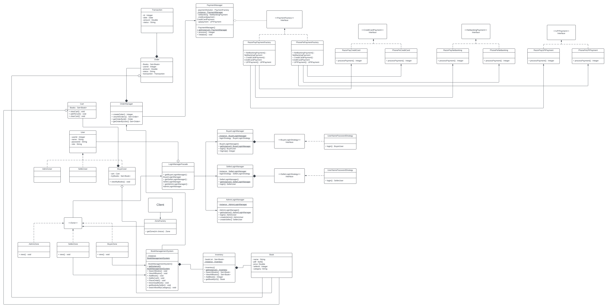

## Online Library Management System

### Low Level Design of Online Library Management System

### Description

```
Console Based App, Programmed in Java, Hibernate and MySQL DB
```

## UML


### Requirements
- Authentication: Login and SignUp
- Actors: Admin, Seller and Buyer
- Buyer can search, browse, and purchase books
- Seller can manage book inventory, add and upload new books
- Admin can add or remove sellers from the system
- Buyers can Place Order and download purchased books in PDF format
- Payment System to manage transactions and orders.